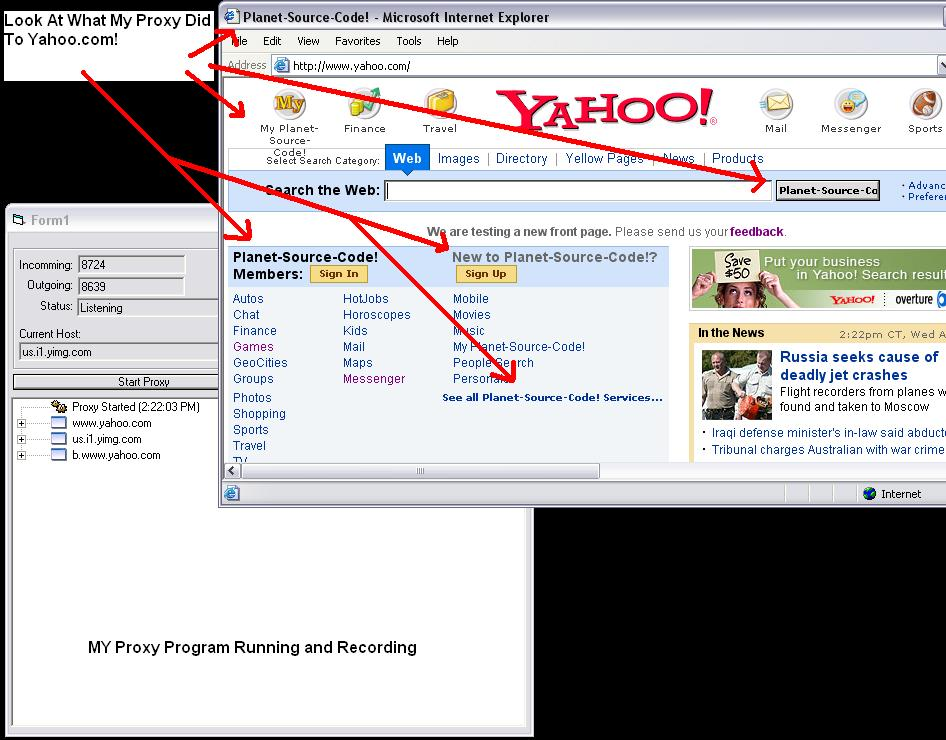



## Intercept/Foward Data Sent and Received from IE

### Description

This program sets one of its winsocks as a proxy and from this you are able to interecpt and alter the data being transfered from IE to the remote host. If you take a look at the screen shot you can see what i was able to do to Yahoo.com with i simple line of code. Please tell me what you think and/or how i can make this better. And i also took it upon myself to make this into an easy control to make building a "Net Nanny" program much easier.
 
### More Info
 

             |
---                |---
**Submitted On**   |2004-08-25 14:44:38
**By**             |[Eric Wolcott](https://github.com/Planet-Source-Code/PSCIndex/blob/master/ByAuthor/eric-wolcott.md)
**Level**          |Intermediate
**User Rating**    |4.2 (25 globes from 6 users)
**Compatibility**  |VB 4\.0 \(32\-bit\), VB 5\.0, VB 6\.0
**Category**       |[Internet/ HTML](https://github.com/Planet-Source-Code/PSCIndex/blob/master/ByCategory/internet-html__1-34.md)
**World**          |[Visual Basic](https://github.com/Planet-Source-Code/PSCIndex/blob/master/ByWorld/visual-basic.md)
**Archive File**   |[Intercept\_1785888252004\.zip](https://github.com/Planet-Source-Code/eric-wolcott-intercept-foward-data-sent-and-received-from-ie__1-55820/archive/master.zip)

